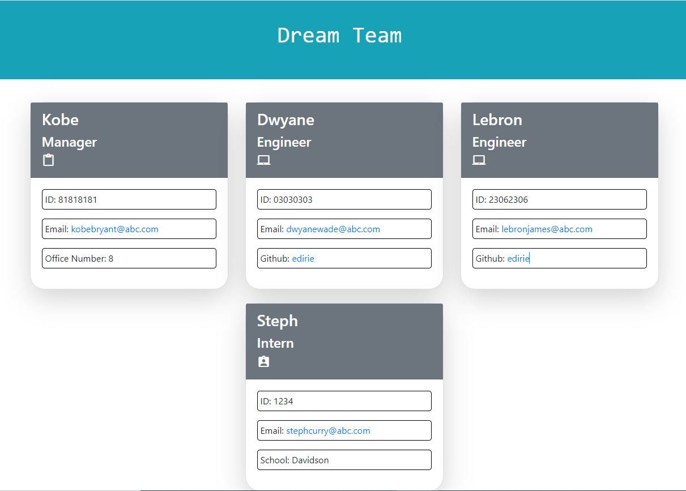

Here is my attempt at generatoring a profile generator using Node and Jest as packages.

# 10 Object-Oriented Programming: Team Profile Generator

Your challenge is to build a Node.js command-line application that takes in information about employees on a software engineering team and generates an HTML webpage that displays summaries for each person. Because testing is key to making code maintainable, you’ll also write unit tests for each part of your code and ensure that it passes all of them.

Because this application won’t be deployed, you’ll also need to provide a link to a walkthrough video that demonstrates its functionality and all of the tests passing. You’ll need to submit a link to the video **and** add it to the README of your project.

## Sample

Here is a screenshot of my page.




## Getting Started

This Challenge will combine many of the skills you’ve learned over the first ten weeks of this course. To help you get started, we’ve provided some guidelines in addition to the User Story and Acceptance Criteria.

Your application should use [Jest](https://www.npmjs.com/package/jest) to run the unit tests and [Inquirer](https://www.npmjs.com/package/inquirer) to collect input from the user. The application will be invoked by using the following command:

```bash
node index.js
```

It is recommended that you start with a directory structure that looks like this:

```md
.
├── __tests__/             //jest tests
│   ├── Employee.test.js
│   ├── Engineer.test.js
│   ├── Intern.test.js
│   └── Manager.test.js
├── dist/                  // rendered output (HTML) and CSS style sheet
├── lib/                   // classes
├── src/                   // template helper code
├── .gitignore             // indicates which folders and files Git should ignore
├── index.js               // runs the application
└── package.json
```

**Important**: Make sure that you remove `dist` from the `.gitignore` file so that Git will track this folder and include it when you push up to your application's repository.

The application must have these classes: `Employee`, `Manager`, `Engineer`, and `Intern`. The tests for these classes (in the `_tests_` directory) **must all pass**.

The first class is an `Employee` parent class with the following properties and methods:

* `name`

* `id`

* `email`

* `getName()`

* `getId()`

* `getEmail()`

* `getRole()`   // Returns 'Employee'

The other three classes will extend `Employee`.

In addition to `Employee`'s properties and methods, `Manager` will also have:

* `officeNumber`

* `getRole()`   // Overridden to return `Manager`

In addition to `Employee`'s properties and methods, `Engineer` will also have:

* `github`  // GitHub username

* `getGithub()`

* `getRole()`   // Overridden to return `Engineer`

In addition to `Employee`'s properties and methods, `Intern` will also have:

* `school`

* `getSchool()`

* `getRole()`   // Overridden to return `Intern`

Finally, although it’s not a requirement, you should consider adding validation to ensure that the user input provided is in the proper expected format.


## Review

You are required to submit the following for review:

* A walkthrough video demonstrating the functionality of the application and passing tests.

* A sample HTML file generated using your application.

* The URL of the GitHub repository. Give the repository a unique name and include a README describing the project.

- - -
© 2022 Trilogy Education Services, LLC, a 2U, Inc. brand. Confidential and Proprietary. All Rights Reserved.
